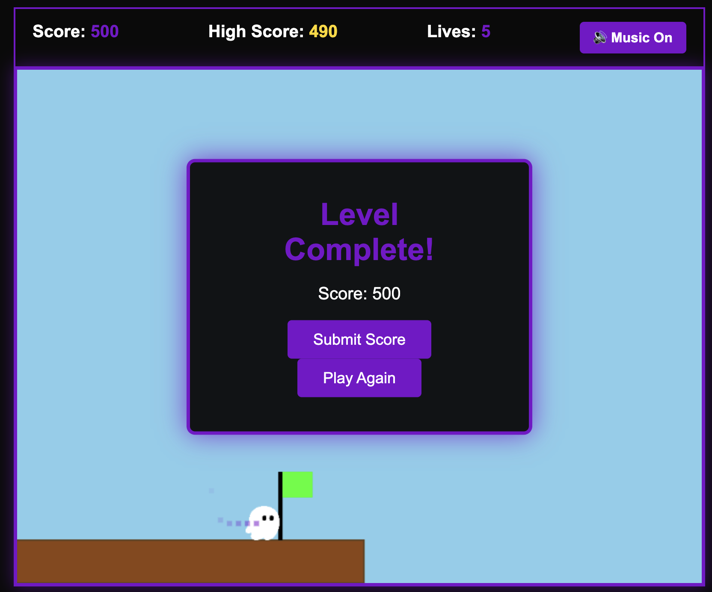

# 🎮 Super Kiro World

A retro-style platformer game built with Go and vanilla JavaScript, featuring advanced movement mechanics, particle effects, and a global leaderboard system.



## ✨ Features

### 🎯 Core Gameplay
- **Classic Platformer Mechanics** - Run, jump, and navigate through challenging levels
- **Double Jump System** - Execute a second jump mid-air for enhanced mobility
- **Flying Animation** - Graceful, floaty physics with sprite rotation
- **Enemy Combat** - Defeat enemies by jumping on them from above
- **Collectibles** - Gather coins and extra lives throughout the level
- **Moving Platforms** - Dynamic obstacles that test your timing

### 🎨 Visual Effects
- **Trail Particles** - Dynamic trails follow your character as you move
- **Explosion Effects** - Dramatic particle bursts on enemy collisions
- **Sparkle Effects** - Satisfying visual feedback when collecting items
- **Confetti Celebration** - Special effect when achieving a new high score
- **Smooth Animations** - 60 FPS gameplay with sprite rotation

### 📊 Progression System
- **High Score Tracking** - Your best score persists across sessions
- **Global Leaderboard** - Compete with other players
- **Score Submission** - Submit your scores with a custom player name
- **Top 10 Display** - See the best scores with timestamps
- **Session Highlighting** - Your current score is highlighted in the leaderboard

### 🎵 Audio
- **Background Music** - Atmospheric soundtrack during gameplay
- **Music Toggle** - Enable/disable music with persistent settings

## 🚀 Quick Start

### Prerequisites
- **Go** 1.21 or higher
- **Node.js** 18 or higher (for running tests)
- Modern web browser (Chrome, Firefox, Safari, or Edge)

### Installation

1. **Clone the repository**
   ```bash
   git clone <repository-url>
   cd super-kiro-world
   ```

2. **Install dependencies** (for testing only)
   ```bash
   npm install
   ```

3. **Start the server**
   ```bash
   go run .
   ```

4. **Open your browser**
   ```
   http://localhost:3000
   ```

5. **Start playing!**
   - Click anywhere or press any key to begin
   - Use arrow keys or WASD to move
   - Press Up Arrow, W, or Spacebar to jump

## 🎮 Controls

| Action | Keys |
|--------|------|
| Move Left | ← or A |
| Move Right | → or D |
| Jump | ↑ or W or Space |
| Double Jump | Press jump again while airborne |
| Toggle Music | Click music button in HUD |

## 🏗️ Architecture

### Backend (Go)
```
├── server.go          # HTTP server and routing
├── handlers.go        # API endpoint handlers
├── leaderboard.go     # Score storage and management
└── leaderboard.json   # Persistent score data
```

### Frontend (JavaScript)
```
static/
├── game.js           # Main game logic
├── index.html        # Game UI structure
└── style.css         # Visual styling
```

### Key Components

#### Backend
- **ScoreStore** - Thread-safe leaderboard management
- **LeaderboardHandler** - RESTful API endpoints
- **File Persistence** - JSON-based score storage

#### Frontend
- **StorageManager** - High score persistence (localStorage)
- **LeaderboardAPI** - Backend communication with error handling
- **ParticleSystem** - Unified particle effect engine
- **JumpController** - Double jump mechanic
- **AnimationController** - Flying physics and sprite rotation
- **LeaderboardUI** - Score submission and display

## 🔌 API Endpoints

### Submit Score
```http
POST /api/leaderboard
Content-Type: application/json

{
  "score": 1500,
  "playerName": "Player1"
}
```

**Response:**
```json
{
  "id": "uuid-string",
  "score": 1500,
  "playerName": "Player1",
  "timestamp": "2024-12-02T10:30:00Z"
}
```

### Get Leaderboard
```http
GET /api/leaderboard?limit=10
```

**Response:**
```json
[
  {
    "id": "uuid-string",
    "score": 2000,
    "playerName": "TopPlayer",
    "timestamp": "2024-12-02T10:30:00Z"
  }
]
```

## 🧪 Testing

### Run All Tests
```bash
# Frontend tests (JavaScript)
npm test

# Backend tests (Go)
go test -v

# Run specific test file
npm test static/game.test.js
```

### Test Coverage
- **62 Frontend Tests** - Unit and property-based tests
- **8 Backend Tests** - API and storage tests
- **10 Property-Based Tests** - Correctness properties verified

### Property-Based Testing
The game uses property-based testing (PBT) to verify correctness properties:
- High score monotonicity
- Jump mechanics consistency
- Particle system constraints
- Animation physics properties

## 🎨 Customization

### Game Physics
Edit `static/game.js`:
```javascript
const player = {
    speed: 3.5,        // Movement speed
    jumpPower: 12,     // Jump strength
    gravity: 0.45,     // Gravity force
    friction: 0.8      // Ground friction
};
```

### Particle Effects
Adjust particle counts in `ParticleSystem`:
```javascript
createSparkle(x, y) {
    const particleCount = Math.floor(Math.random() * 6) + 5; // 5-10
    // ...
}
```

### Leaderboard Limit
Modify the default limit in `handlers.go`:
```go
limit := 10  // Change to desired number
```

## 🐛 Error Handling

The game gracefully handles various error scenarios:

### Frontend
- **Network Errors** - Displays user-friendly messages with retry option
- **Storage Errors** - Handles quota exceeded and private browsing
- **Corrupted Data** - Automatically resets to safe defaults
- **Timeout Errors** - 5-second timeout with retry functionality

### Backend
- **Invalid Input** - Validates player names and scores
- **Concurrent Access** - Thread-safe operations with mutexes
- **File I/O Errors** - Graceful degradation if persistence fails

## 📈 Performance

- **60 FPS Target** - Smooth gameplay maintained
- **500 Particle Limit** - Prevents performance degradation
- **Efficient Rendering** - Camera culling and batch operations
- **Async File Writes** - Non-blocking score persistence

## 🌐 Browser Compatibility

Tested and working on:
- ✅ Chrome (latest)
- ✅ Firefox (latest)
- ✅ Safari (latest)
- ✅ Edge (latest)

## 📝 Development

### Project Structure
```
super-kiro-world/
├── .kiro/
│   └── specs/
│       └── game-enhancements/
│           ├── requirements.md    # Feature requirements
│           ├── design.md          # Technical design
│           └── tasks.md           # Implementation tasks
├── static/
│   ├── game.js                    # Game logic
│   ├── game.test.js               # Frontend tests
│   ├── index.html                 # UI structure
│   ├── style.css                  # Styling
│   └── background-music.wav       # Audio
├── server.go                      # HTTP server
├── handlers.go                    # API handlers
├── handlers_test.go               # Backend tests
├── leaderboard.go                 # Score management
├── leaderboard_test.go            # Storage tests
├── go.mod                         # Go dependencies
├── package.json                   # Node dependencies
└── README.md                      # This file
```

### Adding New Features

1. **Update Requirements** - Add acceptance criteria to `.kiro/specs/game-enhancements/requirements.md`
2. **Design the Feature** - Document in `.kiro/specs/game-enhancements/design.md`
3. **Create Tasks** - Break down implementation in `.kiro/specs/game-enhancements/tasks.md`
4. **Implement** - Write code following the design
5. **Test** - Add unit and property-based tests
6. **Integrate** - Ensure all features work together

### Code Style

**JavaScript:**
- Use ES6+ features
- Modular design with clear separation of concerns
- Comprehensive error handling
- JSDoc comments for complex functions

**Go:**
- Follow standard Go conventions
- Use meaningful variable names
- Add comments for exported functions
- Handle errors explicitly

## 🤝 Contributing

Contributions are welcome! Please follow these steps:

1. Fork the repository
2. Create a feature branch (`git checkout -b feature/amazing-feature`)
3. Write tests for your changes
4. Ensure all tests pass (`npm test && go test -v`)
5. Commit your changes (`git commit -m 'Add amazing feature'`)
6. Push to the branch (`git push origin feature/amazing-feature`)
7. Open a Pull Request

## 📄 License

This project is part of the AWS re:Invent workshop and is provided as-is for educational purposes.

## 🙏 Acknowledgments

- Built with ❤️ using Kiro AI Assistant
- Kiro logo used as player sprite
- Inspired by classic platformer games
- Property-based testing powered by [fast-check](https://github.com/dubzzz/fast-check)

## 📞 Support

If you encounter any issues:

1. Check the browser console for error messages
2. Review the `INTEGRATION_TEST_REPORT.md` for troubleshooting
3. Ensure the server is running on port 3000
4. Verify Node.js and Go versions meet requirements

## 🎯 Future Enhancements

Potential features for future development:
- Additional levels with increasing difficulty
- Sound effects for game events
- Power-ups and special abilities
- Mobile touch controls
- Multiplayer support
- Achievement system
- Time-based challenges
- Level editor

## 🏆 High Scores

The leaderboard tracks the top 10 scores of all time. Can you make it to the top?

**Current Features:**
- Persistent storage across sessions
- Player name customization
- Timestamp tracking
- Session highlighting
- Automatic sorting

---

**Made with Kiro** | [Play Now](http://localhost:3000) | [View Tests](INTEGRATION_TEST_REPORT.md)

*Happy Gaming! 🎮*
